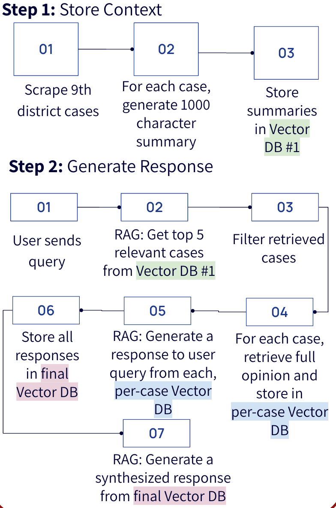

# LLM Case Law
An interactive LLM chatbot that can chat with lawyers regarding their case and help them prepare based on a wealth of historical case information.

## Running Locally
Clone or download this repo
```
git@github.com:MDass/llm_case_law.git
```

Add a .env file in this directory the following line:
```
OPEN_AI_KEY = "[YOUR OPEN AI KEY]"
```

Download opinions files from 
```
https://cdn.ca9.uscourts.gov/assets/Public-Data.pdf
```
and store the unzipped files in this directory

To ingest the opinion texts and summarize the texts, run the cells in:
```
scrape_cases.ipynb
```

To interact with the chat bot, using test promps, run the cells in:
```
query.ipynb
```

To run an breadth evaluation on the generated responses, run the cells in:
```
breadth_evaluation.ipynb
```

## Approach
LLM Case Law uses a 3 step process, including a hierarchical RAG to generate and evaluate a repsonse to a user's query. Read more about the approach in this [Medium article]()



## Credits
LLM Case Law was created by [Shruti Verma](https://www.linkedin.com/in/shruti-verma-18a958138/) and [Megan Dass](https://www.linkedin.com/in/megan-dass), which was the result of a class project at Stanford University.


## License
The software is available under the [MIT License](https://github.com/poloclub/skeletricks/blob/main/LICENSE).

## Contact
If you have any questions, feel free to [open an issue](https://github.com/MDass/llm_case_law/issues/new) or contact [Megan Dass](mailto:mdass9@stanford.edu) or [Shruti Verma](mailto:shrutive@stanford.edu).